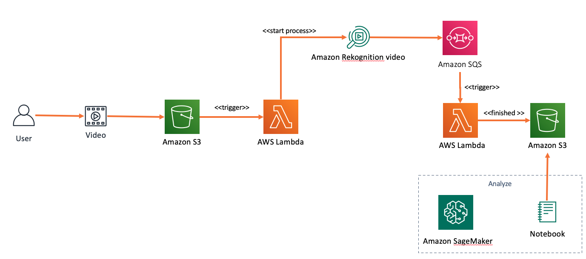

# Rekognition Video Process Report

# Overview 

This repository is an project of example of how to use AWS Rekognition Video to recognize emotions from videos and extract that information creating an report using AWS SageMaker Notebooks.

# Prerequisites: 

- [awscli](https://docs.aws.amazon.com/cli/latest/userguide/cli-chap-install.html)

- [Pre configured AWS credentials](https://docs.aws.amazon.com/amazonswf/latest/developerguide/RubyFlowOptions.html)

# Architecture Diagram



# How to Deploy

## Setup Cloud9 environment

Open the Cloud9 console at https://console.aws.amazon.com/cloud9

- On the Step 1 - Name environment: Enter the Environment name as 'rekognition-emotions'

- On the Step 2 - Configure settings: Just click on Next button

- On the Step 3 - Review: Check the resources being created, and click on Create Environment button

- Once your envionment was provisioned, select the bash tab and execute the following commands:

```

git clone https://github.com/mandalvesq/rekognition-video-process-report.git

cd rekognition-video-process-report/deploy

./deploy.sh
````

# How to Use

To generate the analysis, upload a video with human expressing emotions inside the S3 bucket named: sentiment-analysis-YOURACCOUNTID.

- [How to Upload files to S3](https://docs.aws.amazon.com/AmazonS3/latest/user-guide/upload-objects.html) 

*Obs: The name of the video will be used for the rest of the process. Name it according to the content.*

- Go to the [Sagemaker Notebook Jupyter](https://console.aws.amazon.com/sagemaker)

- On the left menu, click in Notebook Instances

- You will be abble to see the Notebook Instance that the CloudFormation has created. Click in Open Jupyter.

- In the Jupyter console, click in New and than Terminal.


- In the terminal, run:

```
cd SageMaker
git clone https://github.com/mandalvesq/rekognition-video-process-report.git
```
- Open the notebook: rekognition-video-process-report/notebook/sentiment_analysis_notebook.ipynb

- Change the Variable cell commented to the name of your video. Save it.


- click in Cells > Run All Below

- You will be able to see the video analysed by the emotions.


*In the example below, all the emotions that were demonstrated in the video sended to S3.*


*Feel free to create different views using Python Pandas.*

# Cleaning UP
```
cd rekognition-video-process-report/deploy

./destroy.sh
```

## Security

See [CONTRIBUTING](CONTRIBUTING.md#security-issue-notifications) for more information.

## License

This library is licensed under the MIT-0 License. See the LICENSE file.
